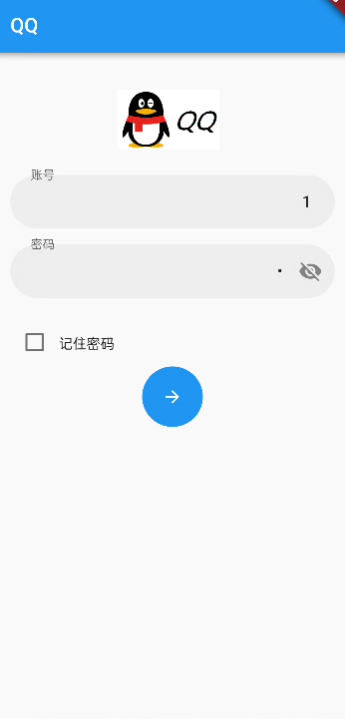
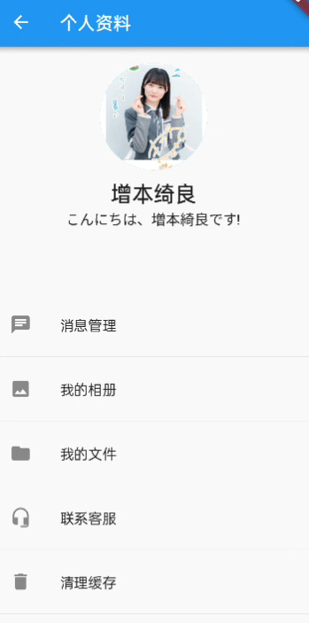
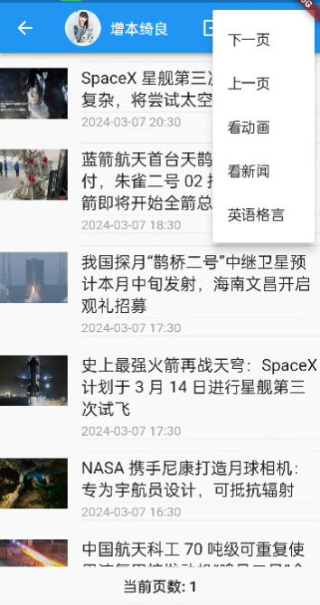

# Flutter-app

flutter的选修课作业（虽然很简陋，而且也不会写前端，但对于以后的学习很有帮助）

## 功能

1. 可以注册和登录账号，修改密码

2. 可以查看聊天列表和人聊天
 
3. 可以查看个人资料 显示头像和功能列表

4. 可以查看新闻，并且查看过的新闻会缓存在数据库上(支持翻页和下载图片)

5. 可以查看动画，还可以点击详情页查看(支持翻页)
 
6. 可以查看英语格言


## 技术栈

使用了flutter，dart语言
注册登录使用sharedreference储存密码
新闻采用sqlite数据库储存和查询
新闻接口和格言接口为天行api (https://bangumi.github.io/api/)
而动画接口为bangumi的api  (https://bangumi.github.io/api/)
展示详情页面使用webView库
下载图片为dio包


## 如何安装

首先安装android studio，
虚拟机/物理机启动即可
如果要安装程序在手机上请按照如下方式操作：
```
flutter build apk –release
flutter install
```

### 碎碎念

1. 学完的感觉就是不太会写flutter
2. 新闻缓存是有bug的，一旦缓存便不会更新新闻了，解决可以使用定时任务的方式
3. 不过学这个也不是没有收获

## 问题和反馈

如果你遇到问题或有任何建议，请在 [GitHub Issues] 中提出。

## 许可证

这个项目采用 [MIT 许可证](LICENSE)。


